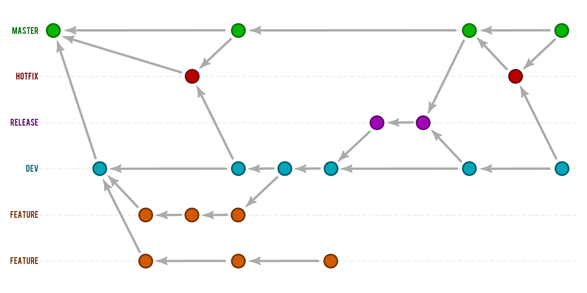

# Branching in Git

Branches are a powerful Git feature, enabling free experimentation and a modular development of a software project.  
Branches in Git are lightweight, and operating with them is extremely fast – often instantneous. This encourages workflows that branch and merge often: in Git, branches are a key part of the everyday development process.  

Git stores changes to the repository as commit objects. Each of them is a snapshot of the repository pointing to an internal tree object, which lists the contents of the working directory (all stored internally). When you make some changes and commit again, the next commit stores a pointer to the commit that came immediately before it.  
A **branch** is simply a movable pointer to one of these commits. The default branch name in Git is `master`. As you start making commits, you’re given a `master` branch that points to the last commit you made. Every time you commit, it moves forward automatically. When multiple commits then point to the same parent, the commit history diverges: switching from a branch to another, files in the working directory will change. If you switch to an older branch, your working directory will be reverted to look like it did the last time you committed on that branch.

---

In this scenario you will learn how to create and manage branches – down to the single commit.  
This will allow you to develop independent sections of the project separately, undo mistakes, automate changes, and even reshape – or rewrite – the commit history of a repository.
