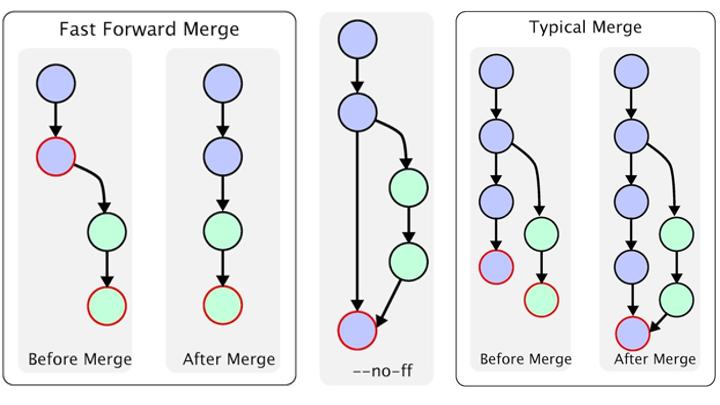

You've created a new branch and switched to it; you also committed some work to the new branch.  
Now, it's time to bring this work into the main stream of our project.

---

If you switch back to the `master` branch, you'll notice that the work you committed on the `installation` branch (that is, the installation.txt file) is not there yet.

*What do you expect to see if you run `git log` now?*

To make that file available to the master branch, we need to merge `installation` into `master`.

We can do this with:  
`git checkout master`{{execute}}  
`git merge installation`{{execute}}

> Generally speaking, to merge `<branch_B>` into `<branch_A>` we need to run:  
`git checkout <branch_A>`  
`git merge <branch_B>`  

*Try merging `installation` into `master` and running `git log` again: what changed since last time?*

---

In this case, Git performed a *Fast Forward* merge. This happens when the commit histories of the two branches have not diverged. In this case, all Git does is push one branch forward to match the other. This is also called an **implicit** merge: this means that it does not add a new commit to the history of the repository.  
The oppsite is a 3-way merge, which compares the two branches (that is, the commits the two branches are pointing to) and creates a new commit (called a *merge commit*) containing the changes in both parents. As it creates a new commit, it is also called an **explicit** merge. This behaviour can be forced even when a fast forward forward would be used, using the command `git merge --no-ff`.

In both cases, a merge can follow several strategies. More material on merging strategies, and on the options for the `git merge` command, can be found in the [Git manual][1] and in the [Atlassian tutorial][2].

## Exercise

**Now that the installation guide is merged in, let's merge in the user manual too.**

**Switch to the `user_manual` branch we created earlier and create a new empty file called "user_manual.txt" (you can use `touch user_manual.txt`{{execute}}).**  
**Commit the new file to the branch, then merge the `user_manual` branch into `master`.**

[1]: https://git-scm.com/docs/merge-strategies
[2]: https://www.atlassian.com/git/tutorials/using-branches/merge-strategy