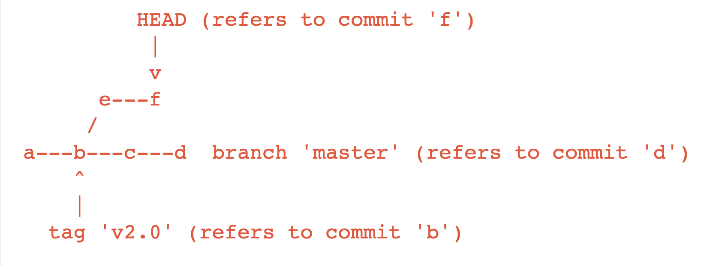

Now that we got the basics, we can introduce more advanced concepts.  
Let's start with the HEAD.

---

If you recall the intro, we mentioned that branches are pointer to commits.
HEAD is a special pointer, referring to a specific commit in the repository, and identifying the "current position".  
At any moment, you can check where HEAD is pointing to using `cat .git/HEAD`{{execute}}  

This means that, in most cases, HEAD is the "current branch". When a branch is checked out, HEAD points to the current branch reference, which is in turn a pointer to the last commit made on that branch. That means HEAD will be the parent of the next commit that is created.  
When a new commit is added to that branch, HEAD (as well as the branch pointer) is updated and moved forward, to reference this last commit.  
If we then switch branch with `git checkout`, HEAD is updated to point to the last commit of the new branch.

### Detached HEAD

Checking out a branch configures the working tree according to the last commit in that branch (that is, the commit that branch is pointing to).  
However, we can `checkout` any commit in the history – not just named branches.
Checking out a commit will update HEAD to that commit. This situation, where HEAD is pointing to an "internal" commit, is called **detached HEAD**.  

In this situation too, new commits will be added to the commit HEAD is pointing to, and HEAD will be updated each time to refer to the most recent commit in the new line. The new commits, however, are only referenced to by HEAD – and not by any other branch. If we `checkout` another branch, HEAD will be updated to this branch and those commits will be deleted by Git. To avoid this, we need to create a new branch or tag that will point to them.

