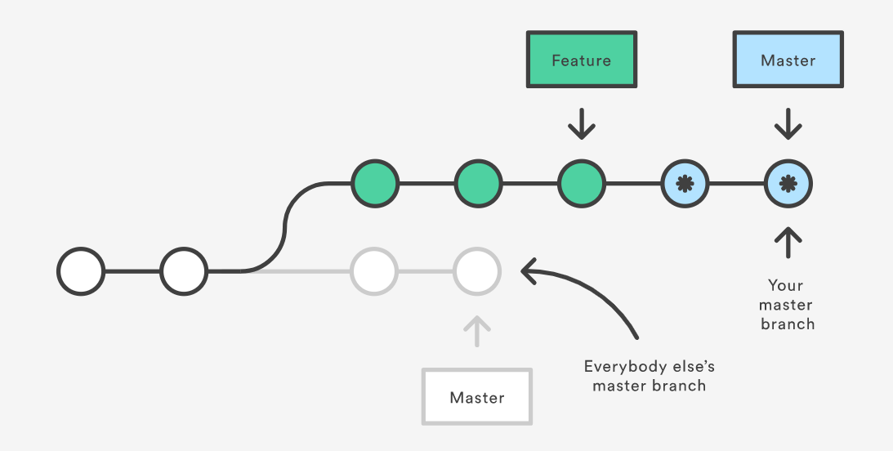

Git is used in countless software projects and branching is a key point to its success.  
Now you know how branches work in Git – but how are they used in real life?

---

Most Git project follow a **workflow**: a blueprint for the structure of the project, guiding how branching should be used.  
Let's see some common workflows; for more information, check the [Pro Git book chapter][1] and the [Atlassian tutorial][2] on workflows.

### Centralized Workflow

A centralized workflow doesn't use any branch other than `master`. All changes are committed to `master`; commits diverging from it are rebased on `master` and conflicts are manually resolved.

*Note that conflicts will be explained in detail in the next scenario.*

### Long-running branches

Git allows to easily maintain and merge branches. For this reason, a project can sustain a number of branches open indefinitely. A common use is to keep a 'stable' branch, say `master`, untouched, and another branch (usually called `develop`) on which changes are committed. Periodically, `develop` is then merged back into `master`.  

The most common variation of this is topic branching or **feature branching**, where each individual feature of the project is develop on a separate branch. These branches are created from `develop`, and merged back in when the development of the feature is complete.  
An even higher degree of specialization is obtained in the **Gitflow** model, which, as well as master, develop and feature branches, hosts specific branches for releases and hotfixes. Gitflow will be explained in detail in the last scenario of this course.

### Forking

The last workflow is radically different, as it involves creating a complete copy of a remote repository, called a **fork**. Each fork of the original repository is completely independent and private to a single developer, adding an even higher degree of separation. Each fork can still implement another branching model (like feature branching) internally; features are then brought to the original repository via pull requests, which will be explained in detail the next scenarios.  
The forking workflow is commonly used in public open-source projects, and it involves remote repositories which will be the object of the next scenario.

[1]: https://git-scm.com/book/en/v2/Git-Branching-Branching-Workflows
[2]: https://www.atlassian.com/git/tutorials/comparing-workflows
